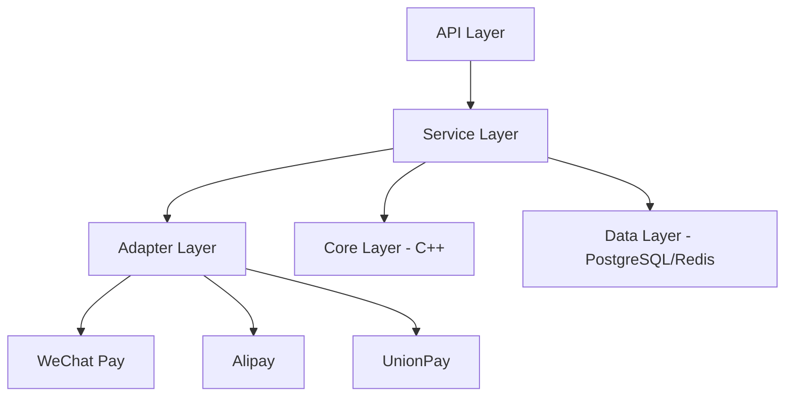

# Design Document

## Overview

This document outlines the design for implementing a comprehensive payment and membership system for the GaokaoHub platform. The system will include payment processing capabilities for WeChat Pay, Alipay, and UnionPay, as well as a tiered membership system with device binding and anti-cracking protections. This feature is critical for the commercial success of the platform as it enables revenue generation through subscription-based access to premium features.

The design follows the microservices architecture pattern with a Go-based payment service that integrates with C++ core modules for license validation and security features. The system will be modular, following single responsibility principles, and will integrate with existing components where possible.

## Steering Document Alignment

### Technical Standards (tech.md)
The design follows the documented technical patterns and standards:
- Microservices architecture with Go (70%) and C++ (30%)
- PostgreSQL for primary storage and Redis for caching
- JWT authentication with refresh tokens
- VMProtect for C++ code protection and garble for Go code obfuscation
- Docker containerization with Kubernetes deployment

### Project Structure (structure.md)
The implementation will follow project organization conventions:
- Go microservices in the services/ directory
- C++ core modules in the cpp/ directory
- Shared assets in the shared/ directory
- Configuration files in deployments/ and shared/configs/

## Code Reuse Analysis

### Existing Components to Leverage
- **Database Layer**: Existing PostgreSQL and Redis integration patterns will be reused
- **Authentication Middleware**: JWT-based authentication middleware from other services
- **Configuration Management**: Existing config loading patterns from other services
- **Logging**: Structured logging with zap/sirupsen from other services
- **Error Handling**: Standard error handling patterns from other services

### Integration Points
- **API Gateway**: Integration with existing API gateway for unified access
- **User Service**: Integration with user service for membership status checks
- **Database**: PostgreSQL for payment orders, membership plans, and user memberships
- **Cache**: Redis for caching membership status and payment information

## Architecture

The payment and membership system follows a modular design with clear separation of concerns:

1. **API Layer**: RESTful API endpoints for payment creation, callback handling, and membership management
2. **Service Layer**: Business logic for payment processing and membership management
3. **Adapter Layer**: Payment channel adapters for WeChat Pay, Alipay, and UnionPay
4. **Core Layer**: C++ modules for license validation and security features
5. **Data Layer**: PostgreSQL for persistent storage and Redis for caching

### Modular Design Principles
- **Single File Responsibility**: Each file handles one specific concern or domain
- **Component Isolation**: Small, focused components rather than large monolithic files
- **Service Layer Separation**: Separate data access, business logic, and presentation layers
- **Utility Modularity**: Focused, single-purpose utility modules



## Components and Interfaces

### Payment Service
- **Purpose:** Handle payment processing and order management
- **Interfaces:** 
  - CreatePayment(ctx context.Context, req *PaymentRequest) (*PaymentResponse, error)
  - VerifyCallback(ctx context.Context, channel string, data []byte, signature string) (*PaymentCallback, error)
  - QueryPayment(ctx context.Context, orderNo string) (*QueryResponse, error)
  - CreateRefund(ctx context.Context, req *RefundRequest) (*RefundResponse, error)
- **Dependencies:** Payment adapters, database, Redis cache
- **Reuses:** Database connection patterns, Redis caching patterns

### Membership Service
- **Purpose:** Manage membership plans, subscriptions, and user benefits
- **Interfaces:**
  - GetPlans(ctx context.Context) ([]*MembershipPlan, error)
  - Subscribe(ctx context.Context, userID, orderNo string) error
  - GetMembershipStatus(ctx context.Context, userID string) (*MembershipStatusResponse, error)
  - RenewMembership(ctx context.Context, userID, planCode string) (string, error)
  - CancelMembership(ctx context.Context, userID string) error
  - GetMemberBenefits(ctx context.Context, userID string) (map[string]interface{}, error)
  - ConsumeQuery(ctx context.Context, userID string) error
  - ConsumeDownload(ctx context.Context, userID string) error
- **Dependencies:** Database, Redis cache
- **Reuses:** Database connection patterns, Redis caching patterns

### Payment Adapters
- **Purpose:** Interface with external payment channels
- **Interfaces:**
  - CreatePayment(ctx context.Context, req *PaymentRequest) (*PaymentResponse, error)
  - VerifyCallback(ctx context.Context, data []byte, signature string) (*PaymentCallback, error)
  - QueryPayment(ctx context.Context, req *QueryRequest) (*QueryResponse, error)
  - CreateRefund(ctx context.Context, req *RefundRequest) (*RefundResponse, error)
- **Dependencies:** HTTP clients, cryptographic libraries
- **Reuses:** HTTP client patterns, error handling patterns

## Data Models

### PaymentOrder
```go
type PaymentOrder struct {
    ID              int64           `json:"id"`
    OrderNo         string          `json:"order_no"`
    UserID          string          `json:"user_id"`
    Amount          decimal.Decimal `json:"amount"`
    Currency        string          `json:"currency"`
    Subject         string          `json:"subject"`
    Description     string          `json:"description"`
    Status          string          `json:"status"`
    PaymentChannel  string          `json:"payment_channel"`
    ChannelTradeNo  string          `json:"channel_trade_no"`
    ClientIP        string          `json:"client_ip"`
    NotifyURL       string          `json:"notify_url"`
    ReturnURL       string          `json:"return_url"`
    ExpireTime      *time.Time      `json:"expire_time"`
    PaidAt          *time.Time      `json:"paid_at"`
    CreatedAt       time.Time       `json:"created_at"`
    UpdatedAt       time.Time       `json:"updated_at"`
    Metadata        JSONB           `json:"metadata"`
}
```

### MembershipPlan
```go
type MembershipPlan struct {
    ID           int64           `json:"id"`
    PlanCode     string          `json:"plan_code"`
    Name         string          `json:"name"`
    Description  string          `json:"description"`
    Price        decimal.Decimal `json:"price"`
    DurationDays int             `json:"duration_days"`
    Features     JSONB           `json:"features"`
    MaxQueries   int             `json:"max_queries"`
    MaxDownloads int             `json:"max_downloads"`
    IsActive     bool            `json:"is_active"`
    CreatedAt    time.Time       `json:"created_at"`
    UpdatedAt    time.Time       `json:"updated_at"`
}
```

### UserMembership
```go
type UserMembership struct {
    ID            int64     `json:"id"`
    UserID        string    `json:"user_id"`
    PlanCode      string    `json:"plan_code"`
    OrderNo       string    `json:"order_no"`
    StartTime     time.Time `json:"start_time"`
    EndTime       time.Time `json:"end_time"`
    Status        string    `json:"status"`
    AutoRenew     bool      `json:"auto_renew"`
    UsedQueries   int       `json:"used_queries"`
    UsedDownloads int       `json:"used_downloads"`
    CreatedAt     time.Time `json:"created_at"`
    UpdatedAt     time.Time `json:"updated_at"`
}
```

## Error Handling

### Error Scenarios
1. **Payment Creation Failure:** When a payment cannot be created due to invalid parameters or payment channel issues
   - **Handling:** Log the error, update order status to failed, return user-friendly error message
   - **User Impact:** User sees error message and can retry or choose another payment method

2. **Callback Verification Failure:** When a payment callback cannot be verified
   - **Handling:** Log the verification failure, do not update order status, return appropriate response to payment channel
   - **User Impact:** Payment may not be immediately reflected in the system, but will be processed asynchronously

3. **Membership Activation Failure:** When a membership cannot be activated after successful payment
   - **Handling:** Log the error, alert administrators, provide manual activation mechanism
   - **User Impact:** User may need to contact support to activate their membership

## Testing Strategy

### Unit Testing
- Test each service method with mocked dependencies
- Test payment adapter implementations with mocked HTTP clients
- Test membership calculation logic (expiration dates, benefits)
- Test error handling paths

### Integration Testing
- Test payment flow from creation to callback handling
- Test membership activation after payment
- Test membership renewal and cancellation flows
- Test quota consumption for queries and downloads

### End-to-End Testing
- Test complete payment flows with real payment channels (sandbox environments)
- Test user journey from membership purchase to benefit utilization
- Test edge cases like expired payments, failed callbacks, etc.