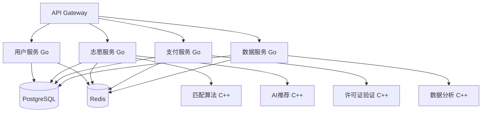

# 高考志愿填报系统 - Go+C++混合架构设计方案

## 1. 架构概述

### 1.1 核心架构决策
基于用户对付费功能和安全防护的严格要求，采用**Go+C++混合架构**：
- **Go作为主框架**（70%代码量）：负责API服务、业务逻辑、数据库操作、用户管理
- **C++核心模块**（30%代码量）：负责算法引擎、AI推理、安全验证、付费功能核心
- **语言间通信**：通过CGO或gRPC实现高效通信
- **安全防护**：C++模块使用VMProtect加密保护，Go使用garble混淆

### 1.2 架构优势
- **开发效率**：Go快速开发，缩短项目周期
- **性能保证**：C++处理计算密集型任务
- **安全防护**：核心付费功能难以被逆向破解
- **维护成本**：Go代码易维护，C++核心相对稳定
- **团队配置**：平衡技能要求和人力成本

## 2. 技术栈详细设计

### 2.1 后端技术栈

#### Go主框架层
```
技术选型：
- Web框架：Gin/Echo
- ORM：GORM
- 缓存：go-redis
- 消息队列：NATS/RabbitMQ
- 配置管理：Viper
- 日志：logrus/zap
- 监控：Prometheus client
```

#### C++核心模块
```
技术选型：
- 数学计算：Eigen 3.4+
- AI推理：ONNX Runtime C++
- JSON处理：nlohmann/json
- HTTP客户端：libcurl
- 加密库：OpenSSL
- 单元测试：Google Test
```

### 2.2 数据存储
- **主数据库**：PostgreSQL 14+（支持分区表）
- **缓存层**：Redis 7.0+（集群模式）
- **搜索引擎**：Elasticsearch 8.0+
- **文件存储**：MinIO/阿里云OSS

### 2.3 部署架构
- **容器化**：Docker + Kubernetes
- **服务网格**：Istio（mTLS通信）
- **API网关**：Kong/Traefik
- **监控**：Prometheus + Grafana
- **日志**：ELK Stack

## 3. 系统架构设计

### 3.1 微服务划分



### 3.2 Go服务模块

#### 用户服务（Go）
- 用户注册/登录
- 会员管理
- 权限控制
- 设备指纹采集

#### 志愿服务（Go）
- 志愿填报界面
- 历史数据查询
- 结果展示
- 调用C++算法引擎

#### 支付服务（Go）
- 微信支付集成
- 支付宝集成
- 银联支付集成
- 订单管理
- 调用C++许可证验证

#### 数据服务（Go）
- 数据ETL流程
- API数据接口
- 缓存管理
- 调用C++数据分析

### 3.3 C++核心模块

#### 志愿匹配算法引擎
```cpp
class VolunteerMatchEngine {
public:
    struct StudentProfile {
        int score;
        std::string province;
        std::string subject_type;
        std::vector<std::string> preferences;
    };
    
    struct MatchResult {
        std::vector<University> recommendations;
        double confidence_score;
        std::string analysis_report;
    };
    
    MatchResult calculateMatch(const StudentProfile& profile);
    std::vector<University> filterByScore(int score, const std::string& province);
    double calculateAdmissionProbability(const University& uni, const StudentProfile& profile);
};
```

#### AI推荐引擎
```cpp
class AIRecommendationEngine {
private:
    std::unique_ptr<Ort::Session> onnx_session;
    
public:
    bool loadModel(const std::string& model_path);
    std::vector<float> predict(const std::vector<float>& features);
    RecommendationResult generateRecommendations(const StudentData& data);
};
```

#### 许可证验证模块
```cpp
class LicenseValidator {
public:
    struct DeviceFingerprint {
        std::string cpu_id;
        std::string motherboard_serial;
        std::string mac_address;
        std::string disk_serial;
    };
    
    bool validateLicense(const std::string& license_key);
    DeviceFingerprint generateFingerprint();
    bool checkDeviceBinding(const std::string& user_id);
    std::string encryptLicense(const LicenseInfo& info);
};
```

## 4. 安全防护体系

### 4.1 代码保护

#### C++代码保护
- **编译优化**：Release模式，启用O3优化
- **符号剥离**：strip命令移除调试符号
- **商业保护**：VMProtect/Themida加壳保护
- **反调试**：检测调试器和虚拟机环境
- **代码混淆**：控制流混淆和字符串加密

#### Go代码保护
- **编译混淆**：garble工具混淆标识符
- **二进制压缩**：UPX压缩可执行文件
- **构建标签**：使用build constraints隐藏敏感代码
- **字符串加密**：敏感字符串运行时解密

### 4.2 部署安全

#### 容器安全
- **最小化镜像**：使用distroless基础镜像
- **多阶段构建**：分离构建和运行环境
- **镜像签名**：Docker Content Trust
- **漏洞扫描**：Trivy/Clair定期扫描
- **运行时保护**：gVisor/Kata Containers

#### 网络安全
- **网络隔离**：Kubernetes NetworkPolicy
- **服务网格**：Istio mTLS加密通信
- **API网关**：Kong限流和认证
- **WAF防护**：CloudFlare/阿里云WAF
- **DDoS防护**：CDN分布式防护

### 4.3 数据安全
- **数据加密**：PostgreSQL TDE透明加密
- **敏感字段**：AES-256加密存储
- **数据脱敏**：开发测试环境数据脱敏
- **备份加密**：GPG加密备份文件
- **审计日志**：所有数据访问记录

## 5. 付费会员系统

### 5.1 会员等级设计

| 等级 | 价格 | 功能权限 |
|------|------|----------|
| 免费版 | 0元 | 基础查询、简单筛选 |
| 基础会员 | 39元/月 | 详细分析、历史数据 |
| 高级会员 | 99元/月 | AI推荐、专家咨询 |
| VIP会员 | 999元/年 | 一对一指导、优先支持 |

### 5.2 支付集成

#### 微信支付
```go
type WeChatPay struct {
    AppID     string
    MchID     string
    APIKey    string
    CertPath  string
}

func (w *WeChatPay) CreateOrder(order *PaymentOrder) (*PaymentResult, error) {
    // 调用C++加密模块生成签名
    signature := cppModule.GenerateSignature(order)
    // 发起支付请求
    return w.requestPayment(order, signature)
}
```

#### 许可证管理
```cpp
struct LicenseInfo {
    std::string user_id;
    std::string membership_level;
    std::time_t expire_time;
    std::vector<std::string> device_fingerprints;
    std::string signature;
};

class LicenseManager {
public:
    std::string generateLicense(const LicenseInfo& info);
    bool validateLicense(const std::string& license_data);
    bool checkDeviceLimit(const std::string& user_id);
    void updateLicenseStatus(const std::string& user_id, const std::string& status);
};
```

## 6. 性能优化策略

### 6.1 缓存策略
- **多级缓存**：本地缓存 + Redis集群
- **缓存预热**：系统启动时预加载热点数据
- **缓存更新**：基于事件的缓存失效机制
- **缓存穿透**：布隆过滤器防护

### 6.2 数据库优化
- **读写分离**：主库写入，从库查询
- **分库分表**：按省份和年份分片
- **索引优化**：复合索引覆盖常用查询
- **连接池**：pgxpool管理数据库连接

### 6.3 算法优化
- **并行计算**：C++ OpenMP并行处理
- **内存池**：预分配内存减少GC压力
- **算法缓存**：相似查询结果缓存
- **批量处理**：批量数据处理提高吞吐量

## 7. 开发计划

### 7.1 团队配置
- **Go开发者**：3人（API服务、业务逻辑）
- **C++专家**：2人（核心算法、安全模块）
- **DevOps工程师**：1人（部署运维）
- **安全工程师**：1人（防护策略）
- **测试工程师**：1人（质量保证）
- **产品经理**：1人（需求管理）

### 7.2 开发周期（18周）

#### 第1-3周：基础设施
- Go项目框架搭建
- C++开发环境配置
- 数据库设计和初始化
- CI/CD流水线搭建

#### 第4-6周：用户系统
- 用户注册登录（Go）
- 设备指纹采集（C++）
- 权限管理系统（Go）
- 基础安全防护

#### 第7-9周：核心功能
- 志愿匹配算法（C++）
- 数据查询接口（Go）
- 缓存系统集成
- 性能优化

#### 第10-12周：AI系统
- AI推荐引擎（C++）
- 模型训练和部署
- 推荐结果展示（Go）
- 算法调优

#### 第13-15周：付费系统
- 支付接口集成（Go）
- 许可证管理（C++）
- 会员权限控制
- 订单管理系统

#### 第16-18周：安全加固
- 代码混淆和加密
- 渗透测试和修复
- 性能压力测试
- 部署和上线

### 7.3 里程碑检查
- **第3周**：基础架构完成
- **第6周**：用户系统上线
- **第9周**：核心功能测试
- **第12周**：AI系统集成
- **第15周**：付费功能完成
- **第18周**：系统正式发布

## 8. 商业化策略

### 8.1 营销推广
- **学校合作**：与重点高中建立合作关系
- **教育展会**：参加教育类展会推广
- **社交媒体**：抖音、微博KOL合作
- **免费试用**：首月免费吸引用户

### 8.2 用户增长
- **推荐奖励**：老用户推荐获得免费会员
- **用户社区**：建立用户交流社区
- **内容营销**：高考志愿填报指南
- **数据报告**：发布高考趋势分析报告

### 8.3 收入预测
- **第一年目标**：10万注册用户
- **付费转化率**：15%
- **平均客单价**：年费300元
- **年收入目标**：500万元
- **成本控制**：服务器成本<10%，人力成本<60%

## 9. 风险控制

### 9.1 技术风险
- **语言集成**：Go-C++通信性能测试
- **安全防护**：定期安全审计和渗透测试
- **性能瓶颈**：关键路径性能监控
- **数据一致性**：分布式事务处理

### 9.2 商业风险
- **竞争对手**：差异化功能和服务
- **政策变化**：关注教育政策调整
- **用户流失**：用户满意度调研
- **盗版风险**：多层防护机制

### 9.3 合规风险
- **数据保护**：遵循《个人信息保护法》
- **资质申请**：ICP许可证、数据处理备案
- **财务合规**：税务申报和发票管理
- **知识产权**：算法专利申请保护

## 10. 总结

本设计方案采用Go+C++混合架构，充分发挥两种语言的优势：
- **Go负责快速开发**：API服务、业务逻辑、系统集成
- **C++保证核心安全**：算法引擎、AI推理、安全验证
- **混合架构优势**：开发效率与安全性能的最佳平衡

预计18周完成开发，团队9人，总预算150万元，第一年目标收入500万元。该方案既满足了技术先进性要求，又充分考虑了商业化运营的实际需求，是高考志愿填报系统的最优技术选择。